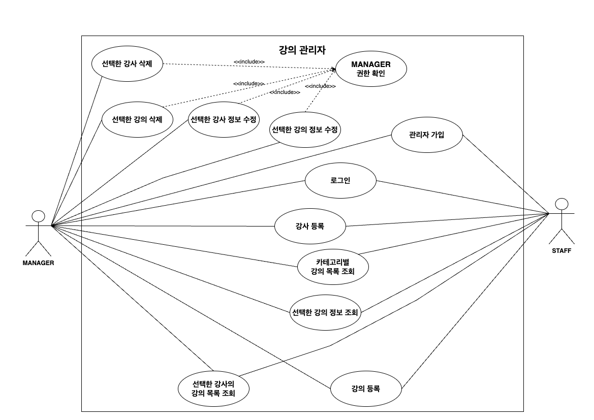

# 항해99 주특기 Lv.3 과제 - 강의 관리자 백오피스 백엔드 REST API

## 📝 개요
- 강의 관리자 백오피스 RESTful API 개발 과제입니다.
---

### 🛠️ Stack
- IntelliJ IDEA Ultimate
- Gradle
- Spring Security
- Spring boot v3.2.3
- Spring MVC
- Spring Data JPA
- MySQL
- Java 17

### ERD - https://www.erdcloud.com/d/YRfknvLHCL5a8hGFX

### Usecase Diagram

### API 명세서 (Postman)
- Postman API Document 입니다.
- https://documenter.getpostman.com/view/28420346/2sA2xfXszF#659ec8d5-65a7-447d-a8f3-4ca8eec7613d

---

## 💡주요 기능
- 회원(관리자)
  - [x] 회원 가입
  - [x] 회원 로그인
- 강사
  - [x] 강사 등록
  - [x] 선택한 강사 정보 수정 - MANAGER 권한만 가능
  - [x] 선택한 강사 정보 조회
  - [x] 선택한 강사의 강의 목록 조회
  - [x] 선택한 강사 삭제 - MANAGER 권한만 가능
- 강의
  - [x] 강의 등록
  - [x] 선택한 강의 정보 수정 - MANAGER 권한만 가능
  - [x] 선택한 강의 정보 조회
  - [x] 카테고리 강의 목록 조회
  - [x] 선택한 강의 삭제 - MANAGER 권한만 가능
